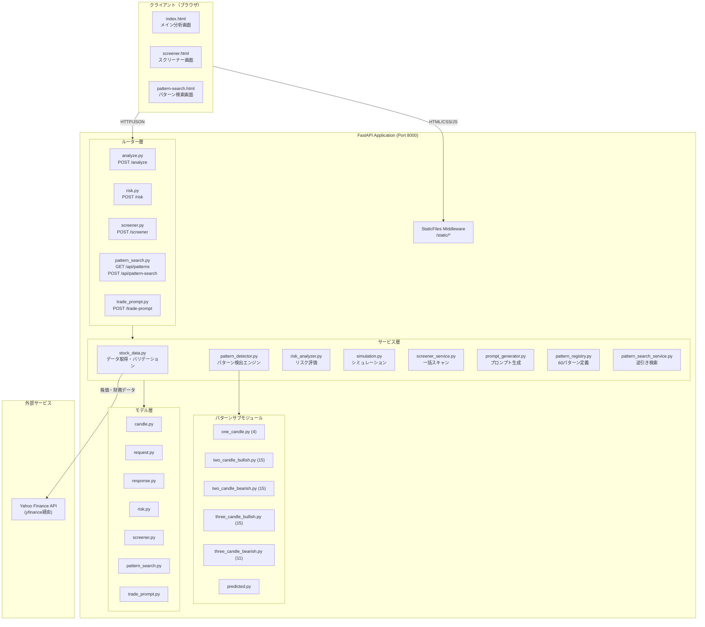
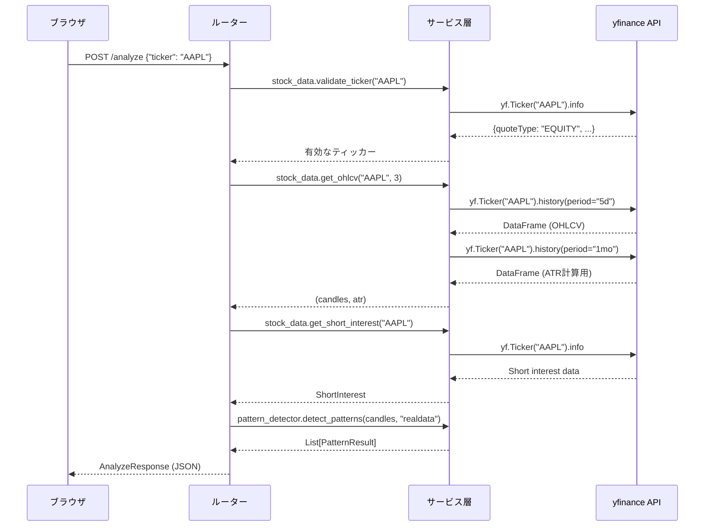
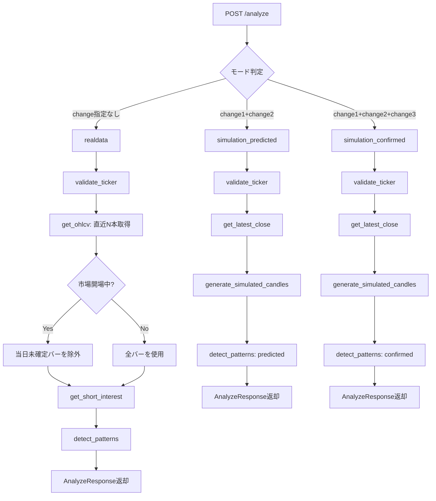
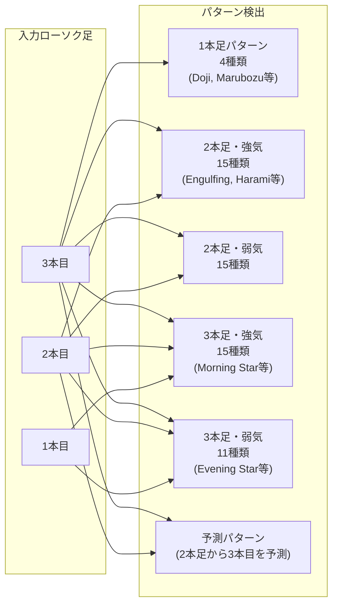
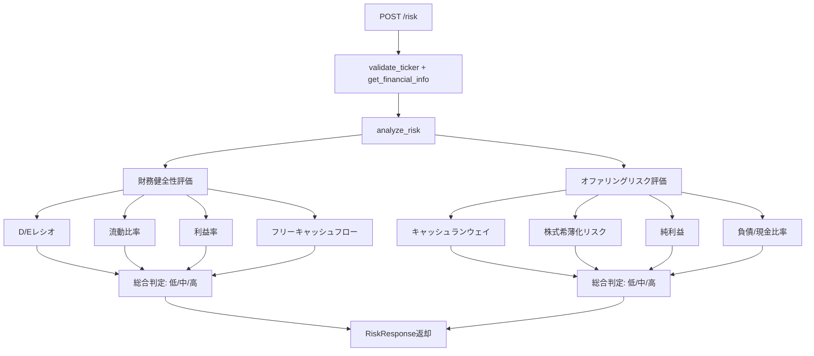
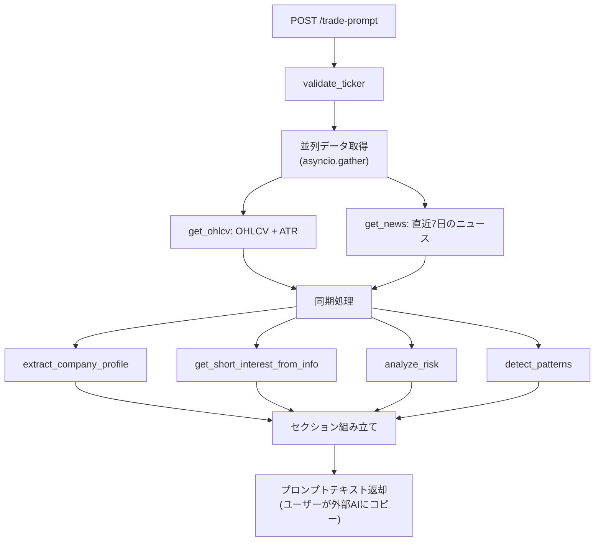
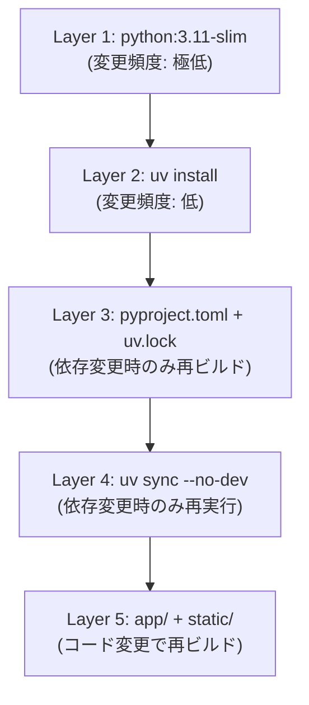
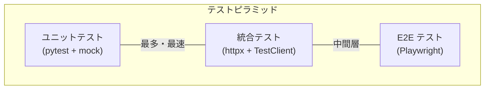

# アーキテクチャ設計書

## 1. システム概要

US Stock Candle Gainers は、米国株式のローソク足パターン認識とリスク分析を行うWebアプリケーションである。ユーザーがティッカーシンボルを入力すると、リアルタイムの株価データを取得し、60種類のローソク足パターンを検出、財務リスクを評価し、AIトレードプロンプトを生成する。

### 主要機能

| 機能 | 説明 | エンドポイント |
|------|------|---------------|
| パターン分析 | 直近2-3本のローソク足からパターンを検出 | `POST /analyze` |
| リスク分析 | 財務健全性とオファリングリスクを評価 | `POST /risk` |
| スクリーナー | 複数ティッカーを一括スキャン | `POST /screener` |
| パターン検索 | 特定パターンを持つ銘柄を逆引き検索 | `POST /api/pattern-search` |
| パターン一覧 | 登録済み全パターンのリスト取得 | `GET /api/patterns` |
| AIトレードプロンプト | 外部AI用の分析プロンプトを生成 | `POST /trade-prompt` |
| シミュレーション | 仮想ローソク足でパターンを検証 | `POST /analyze` (変動率指定時) |

### 設計上の重要な判断

- **データベース不使用**: 全データをyfinance APIからリアルタイム取得。永続化層を排除することで運用コストとシステム複雑性を最小化。
- **認証不要**: パブリックな株価データのみを扱うため、認証/認可は不要。
- **外部AI API未使用**: プロンプト生成のみを行い、ユーザーが自身のAIツールにコピーして使用する設計。API課金リスクを排除。
- **静的フロントエンド**: SPAフレームワーク不使用。FastAPIが直接HTMLを配信し、ビルドステップを排除。

---

## 2. 技術スタック

### バックエンド

| カテゴリ | 技術 | バージョン | 用途 |
|----------|------|-----------|------|
| 言語 | Python | >= 3.11 | 型ヒント・パフォーマンス改善 |
| Webフレームワーク | FastAPI | >= 0.115.0 | APIルーティング・バリデーション |
| ASGIサーバー | Uvicorn | >= 0.32.0 | 非同期HTTP処理 |
| データ取得 | yfinance | >= 0.2.40 | Yahoo Finance API経由の株価データ取得 |
| バリデーション | Pydantic | >= 2.9.0 | リクエスト/レスポンススキーマ定義 |
| 環境変数 | python-dotenv | >= 1.0.0 | `.env`ファイルの読み込み |

### フロントエンド（CDN経由）

| 技術 | 用途 |
|------|------|
| Tailwind CSS | ユーティリティファーストのスタイリング |
| html2canvas | チャート・分析結果の画像エクスポート |
| Google Fonts (Sora, IBM Plex Mono) | タイポグラフィ |

### 開発ツール

| ツール | バージョン | 用途 |
|--------|-----------|------|
| uv | - | パッケージ管理・仮想環境 |
| pytest | >= 8.0 | テストフレームワーク |
| pytest-asyncio | >= 0.24.0 | 非同期テストサポート |
| httpx | >= 0.27 | テスト用HTTPクライアント |
| ruff | >= 0.8 | リンター・フォーマッター |

---

## 3. システムアーキテクチャ図

### 全体構成



### リクエスト処理フロー



---

## 4. ディレクトリ構成と各層の責務

```
us-stock-candle-gainers/
├── app/                          # アプリケーション本体
│   ├── __init__.py
│   ├── exceptions.py             # カスタム例外定義
│   ├── main.py                   # FastAPIアプリケーション・例外ハンドラ
│   ├── models/                   # Pydanticモデル（データ契約）
│   │   ├── candle.py             # CandleData, PatternResult, ShortInterest
│   │   ├── pattern_search.py     # パターン検索リクエスト/レスポンス
│   │   ├── request.py            # AnalyzeRequest, RiskRequest
│   │   ├── response.py           # AnalyzeResponse, RiskResponse, ErrorResponse
│   │   ├── risk.py               # RiskMetric, FinancialHealth, OfferingRisk
│   │   ├── screener.py           # ScreenerRequest/Response, TickerScanResult
│   │   └── trade_prompt.py       # TradePromptRequest/Response
│   ├── routers/                  # HTTPエンドポイント定義（薄いコントローラ層）
│   │   ├── analyze.py            # パターン分析・シミュレーション
│   │   ├── pattern_search.py     # パターン逆引き検索
│   │   ├── risk.py               # リスク分析
│   │   ├── screener.py           # 一括スクリーニング
│   │   └── trade_prompt.py       # AIトレードプロンプト生成
│   └── services/                 # ビジネスロジック
│       ├── pattern_detector.py   # パターン検出エントリーポイント・ヘルパー関数
│       ├── pattern_registry.py   # 60パターンの静的レジストリ
│       ├── pattern_search_service.py # 逆引き検索ロジック
│       ├── patterns/             # パターン検出サブモジュール
│       │   ├── one_candle.py     # 1本足パターン（4種）
│       │   ├── two_candle_bullish.py  # 2本足・強気（15種）
│       │   ├── two_candle_bearish.py  # 2本足・弱気（15種）
│       │   ├── three_candle_bullish.py # 3本足・強気（15種）
│       │   ├── three_candle_bearish.py # 3本足・弱気（11種）
│       │   └── predicted.py      # 予測パターン
│       ├── prompt_generator.py   # AI用プロンプト組み立て
│       ├── risk_analyzer.py      # 財務リスク・オファリングリスク評価
│       ├── screener_service.py   # 複数ティッカー一括処理
│       ├── simulation.py         # 仮想ローソク足生成
│       └── stock_data.py         # yfinanceラッパー
├── static/                       # 静的ファイル（FastAPIが配信）
│   ├── index.html                # メイン分析画面
│   ├── screener.html             # スクリーナー画面
│   └── pattern-search.html       # パターン検索画面
├── tests/                        # テストスイート（33ファイル）
├── docs/                         # ドキュメント
├── Dockerfile                    # コンテナビルド定義
├── pyproject.toml                # プロジェクト設定・依存関係
├── uv.lock                       # 依存関係ロックファイル
└── .env.example                  # 環境変数テンプレート
```

### 各層の責務

| 層 | ディレクトリ | 責務 | 依存方向 |
|----|-------------|------|---------|
| **エントリーポイント** | `main.py` | アプリ初期化、ルーターマウント、例外ハンドラ登録、静的ファイル配信 | Routers, Exceptions |
| **ルーター層** | `routers/` | HTTPリクエストの受付、バリデーション委譲、サービス呼び出し、レスポンス組み立て | Services, Models |
| **サービス層** | `services/` | ビジネスロジック実行、外部API呼び出し、パターン検出、リスク計算 | Models, Exceptions |
| **モデル層** | `models/` | データ構造定義、入出力バリデーション（Pydantic） | なし（最下層） |
| **例外層** | `exceptions.py` | ドメイン固有の例外定義 | なし |

依存関係は **ルーター -> サービス -> モデル** の一方向。循環依存はパターンサブモジュールの遅延インポートで回避。

---

## 5. データフロー

### 5.1 パターン分析フロー（リアルデータモード）



### 5.2 パターン検出の分類



### 5.3 リスク分析フロー



### 5.4 AIトレードプロンプト生成フロー



---

## 6. APIエンドポイント詳細

### エンドポイント一覧

| メソッド | パス | 入力モデル | 出力モデル | 説明 |
|----------|------|-----------|-----------|------|
| `GET` | `/` | - | HTML | メイン分析画面 |
| `GET` | `/screener` | - | HTML | スクリーナー画面 |
| `GET` | `/pattern-search` | - | HTML | パターン検索画面 |
| `POST` | `/analyze` | `AnalyzeRequest` | `AnalyzeResponse` | パターン分析（リアル/シミュレーション） |
| `POST` | `/risk` | `RiskRequest` | `RiskResponse` | 財務リスク分析 |
| `POST` | `/screener` | `ScreenerRequest` | `ScreenerResponse` | 複数ティッカー一括スキャン |
| `GET` | `/api/patterns` | - | `PatternListResponse` | 登録済み全パターン一覧 |
| `POST` | `/api/pattern-search` | `PatternSearchRequest` | `PatternSearchResponse` | パターンID指定の逆引き検索 |
| `POST` | `/trade-prompt` | `TradePromptRequest` | `TradePromptResponse` | AIトレードプロンプト生成 |

### エラーレスポンス

| HTTPステータス | 例外クラス | 発生条件 |
|---------------|-----------|---------|
| 400 | `TickerNotFoundError` | ティッカーが存在しない |
| 400 | `TickerNotEquityError` | ティッカーが株式(EQUITY)でない（ETF, INDEX等） |
| 422 | Pydantic ValidationError | リクエストスキーマ不正（FastAPI自動処理） |
| 500 | `DataFetchError` | yfinance APIエラー・ネットワーク障害 |

エラーメッセージは全て日本語で返却される。

---

## 7. 外部依存関係

### yfinance API

本システムの唯一の外部データソース。

```
┌──────────────────────┐
│   yfinance (Python)  │
│                      │
│  ┌────────────────┐  │
│  │ Yahoo Finance  │  │
│  │ 非公式API      │  │
│  └────────────────┘  │
└──────────────────────┘
```

| 利用データ | 取得方法 | 用途 |
|-----------|---------|------|
| OHLCV | `history(period="5d")` | ローソク足パターン検出 |
| ATR(14) | `history(period="1mo")` | テクニカル指標 |
| 企業情報 | `.info` | リスク分析・バリデーション |
| 空売り比率 | `.info` (shortPercentOfFloat等) | 空売りリスク評価 |
| ニュース | `.news` | AIプロンプトに含める直近ニュース |

### 制約と注意事項

- **APIキー不要**: yfinanceは無料・認証不要だが、Yahoo Finance の非公式APIに依存
- **レート制限**: 公式なレート制限は未公開。大量リクエスト時はスクリーナー機能で注意が必要
- **データ鮮度**: リアルタイムデータではない（15-20分の遅延あり）
- **市場時間対応**: 市場開場中は当日の未確定バーを除外する処理あり（US/Easternタイムゾーン基準）

---

## 8. デプロイ構成（Docker）

### Dockerfile構成

```dockerfile
FROM python:3.11-slim        # 最小限のPythonイメージ
WORKDIR /app
RUN pip install uv            # uvパッケージマネージャーをインストール
COPY pyproject.toml uv.lock ./
RUN uv sync --no-dev          # 本番依存のみインストール（キャッシュ効率化）
COPY app/ ./app/
COPY static/ ./static/
EXPOSE 8000
CMD ["uv", "run", "uvicorn", "app.main:app", "--host", "0.0.0.0", "--port", "8000"]
```

### レイヤーキャッシュ戦略



依存関係ファイル（`pyproject.toml`, `uv.lock`）をアプリケーションコードより先にコピーすることで、コード変更時の依存関係インストールを省略し、ビルド時間を短縮している。

### 環境変数

```
HOST=0.0.0.0    # バインドアドレス
PORT=8000       # リッスンポート
```

`.env.example` で定義。APIキーやシークレットは不要。

---

## 9. テスト戦略

### テスト構成

| カテゴリ | ファイル数 | 対象 |
|----------|-----------|------|
| ルーターテスト | 7 | エンドポイントの入出力、エラーハンドリング |
| サービステスト | 8 | ビジネスロジック、パターン検出精度 |
| モデルテスト | 4 | Pydanticバリデーション |
| パターンテスト | 7 | 60パターン個別の検出ロジック |
| 統合テスト | 4 | モード判定、エッジケース |
| インフラテスト | 3 | 静的ファイル配信、メインアプリ |

合計: **33ファイル**

### テスト方針



- **ユニットテスト**: 各サービス関数を個別にテスト。yfinance呼び出しは`unittest.mock`でモック化
- **統合テスト**: FastAPIの`TestClient`（httpx経由）でルーター層からサービス層までの連携を検証
- **外部依存のモック**: yfinance APIは全テストでモック化し、テストの独立性と高速性を確保
- **非同期テスト**: `pytest-asyncio`（auto mode）で`async`エンドポイントを直接テスト

### 実行方法

```bash
# 全テスト実行
uv run pytest -v

# カバレッジ付き実行
uv run pytest --cov=app --cov-report=term-missing

# 特定カテゴリのみ
uv run pytest tests/test_pattern_detector.py -v

# 高速フィードバック（最初の失敗で停止）
uv run pytest -x
```

---

## 10. セキュリティ考慮事項

### 現在の対策

| 項目 | 状態 | 説明 |
|------|------|------|
| 入力バリデーション | 対応済 | Pydantic v2によるリクエスト自動バリデーション |
| ティッカーバリデーション | 対応済 | yfinance側での存在確認 + EQUITY種別チェック |
| エラー情報の最小化 | 対応済 | ユーザーへの日本語エラーメッセージ。内部エラー詳細は非公開 |
| 秘密情報 | 該当なし | APIキー・パスワード・データベース接続情報なし |
| HTTPS | 未対応 | リバースプロキシ（Nginx等）での対応を想定 |
| CORS | 未設定 | 同一オリジン配信のため現状不要 |
| レート制限 | 未対応 | yfinanceへの過剰リクエスト防止が必要 |

### リスクと緩和策

1. **yfinance API依存リスク**: Yahoo Financeの非公式APIに依存。API変更やアクセス制限時にサービス停止の可能性あり。
   - 緩和策: yfinance のバージョン固定、エラーハンドリングの徹底（`DataFetchError`による graceful degradation）

2. **スクリーナーによる大量リクエスト**: 多数のティッカーを一括スキャンする際、yfinanceへの連続リクエストが発生。
   - 緩和策: 入力ティッカー数の上限設定を検討

3. **DoS攻撃**: レート制限がないため、大量のAPIリクエストで過負荷になる可能性。
   - 緩和策: リバースプロキシでのレート制限、または FastAPI ミドルウェアでの制御

---

## 11. 今後の拡張ポイント

### 短期（機能拡張）

| 項目 | 説明 | 影響範囲 |
|------|------|---------|
| キャッシュ層の追加 | yfinanceレスポンスのインメモリキャッシュ（TTL付き） | `stock_data.py` |
| レート制限 | FastAPIミドルウェアによるリクエスト制限 | `main.py` |
| WebSocketサポート | スクリーナーの進捗リアルタイム通知 | `routers/screener.py` |
| パターン拡張 | 4本足以上のパターン追加 | `services/patterns/` |

### 中期（アーキテクチャ改善）

| 項目 | 説明 | 影響範囲 |
|------|------|---------|
| 非同期化 | 全ルーターの`async`化 + `asyncio.to_thread`によるyfinance呼び出し | `routers/`, `services/` |
| キャッシュDB | Redisによるレスポンスキャッシュ | 新規サービス追加 |
| CDNフロントエンド分離 | 静的ファイルをCDN配信、APIサーバーとの分離 | `static/`, `main.py` |
| ヘルスチェック | `/health` エンドポイント追加 | `main.py` |

### 長期（スケーリング）

| 項目 | 説明 |
|------|------|
| バックグラウンドジョブ | Celery/ARQ によるスクリーナーの非同期実行 |
| データ永続化 | PostgreSQL/SQLite によるスキャン結果・履歴の保存 |
| 外部AI連携 | OpenAI API等への直接接続によるトレード分析の自動化 |
| マルチユーザー対応 | 認証・お気に入り銘柄管理の追加 |

---

## 付録A: パターン検出モード一覧

| モード名 | トリガー条件 | 検出対象 |
|----------|------------|---------|
| `realdata` | change指定なし、candle_count=3 | 1本足 + 2本足 + 3本足 + 予測 |
| `realdata_2candle` | change指定なし、candle_count=2 | 1本足 + 2本足 + 予測 |
| `simulation_predicted` | change1 + change2 指定 | 予測のみ |
| `simulation_confirmed` | change1 + change2 + change3 指定 | 1本足 + 2本足 + 3本足 |

## 付録B: リスク評価指標

### 財務健全性（Financial Health）

| 指標 | 低リスク | 中リスク | 高リスク |
|------|---------|---------|---------|
| D/Eレシオ | < 1.0x | 1.0x - 2.0x | > 2.0x |
| 流動比率 | > 1.5 | 1.0 - 1.5 | < 1.0 |
| 利益率 | > 10% | 0% - 10% | < 0% |
| FCF | > 0 | = 0 | < 0 |

### オファリングリスク（Offering Risk）

| 指標 | 低リスク | 中リスク | 高リスク |
|------|---------|---------|---------|
| キャッシュランウェイ | > 24ヶ月 or 黒字 | 12-24ヶ月 | < 12ヶ月 |
| 希薄化リスク | 黒字+FCF正 | 一部ネガティブ | 赤字+FCF負+高負債 |
| 純利益 | > 0 | = 0 | < 0 |
| 負債/現金比率 | < 1.0 | 1.0 - 3.0 | > 3.0 |

---

*最終更新: 2026-03-11*
